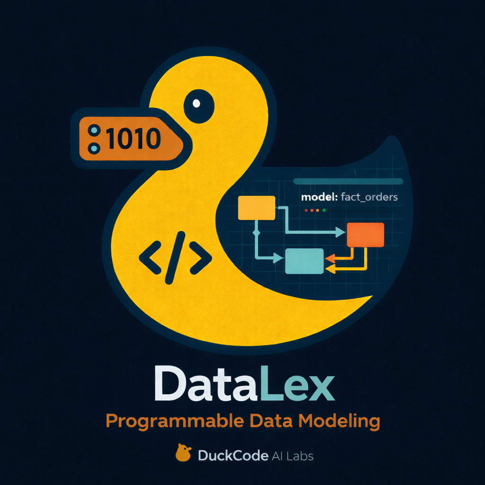
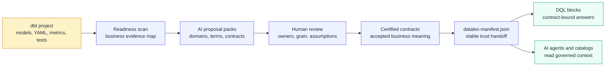

<div align="center">
  <a href="https://duckcode.ai/" target="_blank" rel="noopener noreferrer">
    
  </a>

# DataLex

**AI-first dbt adoption, contracts, diagrams, and manifest publishing.**

DataLex is a local-first OSS workflow for teams that already use dbt. It scans
your existing dbt project, lets AI propose business domains and contracts from
dbt evidence, and writes reviewed DataLex artifacts back to Git.

DataLex does not replace dbt. dbt remains the source of truth for SQL, model
YAML, semantic metrics, tests, exposures, and enforced physical contracts.
DataLex adds the business/domain layer above dbt.

<p align="center">
  <a href="https://pypi.org/project/datalex-cli/">
    
  </a>
  <a href="https://github.com/duckcode-ai/DataLex/blob/main/LICENSE">
    
  </a>
  <a href="https://discord.gg/Dnm6bUvk">
    
  </a>
</p>
</div>

## Architecture flow

DataLex turns dbt evidence into certified business contracts. AI accelerates the
draft, but Git-reviewed contracts remain the trust boundary.



**Why users care:** DataLex gives AI enough context to draft useful governance
assets, but only reviewed and certified definitions enter the manifest that
downstream tools can trust.

## Install from PyPI

Use this path when you want DataLex on your machine or inside an existing dbt
repo.

```bash
python3 -m pip install -U 'datalex-cli[serve]'
datalex --version
datalex serve
```

Open `http://localhost:3030`.

To open DataLex directly on an existing dbt repo:

```bash
cd ~/path/to/your-dbt-project
datalex serve --project-dir .
```

For warehouse drivers, add the matching extra:

```bash
python3 -m pip install -U 'datalex-cli[serve,duckdb]'
python3 -m pip install -U 'datalex-cli[serve,postgres]'
python3 -m pip install -U 'datalex-cli[serve,snowflake]'
python3 -m pip install -U 'datalex-cli[serve,all]'
```

Requirements: Python 3.9+ and Git. The `[serve]` extra includes a portable Node
runtime for the local UI.

## Run with Docker

Use Docker when you do not want to install Python packages on the host.

```bash
git clone https://github.com/duckcode-ai/DataLex.git
cd DataLex
docker build -t datalex:local .
docker run --rm -p 3030:3001 datalex:local
```

To use Docker with an existing dbt repo:

```bash
cd ~/path/to/your-dbt-project
docker run --rm -p 3030:3001 \
  -v "$PWD":/workspace \
  -e REPO_ROOT=/workspace \
  -e DM_CLI=/app/datalex \
  datalex:local
```

In the UI, choose `/workspace` as the dbt project path.

## Core workflow

```text
Connect dbt repo -> AI Setup -> Readiness -> Generate -> Review -> Contracts -> Publish
```

1. **Connect** your dbt repo.
2. **Set up AI** with OpenAI, Claude, or Ollama.
3. **Scan readiness** from dbt manifest, YAML, metrics, tests, exposures, owners, and contracts.
4. **Generate focused proposal packs** for one domain, model group, or metric family.
5. **Review and certify** proposals before anything becomes trusted.
6. **Publish** `datalex-manifest.json` from certified contracts.

Generation requires a tested AI provider. Readiness works without AI, but
DataLex will not create fake domains or placeholder contracts.


## AI setup

DataLex uses your dbt evidence to generate proposals:

- `target/manifest.json`
- dbt model YAML
- semantic models and metrics
- tests and relationships
- exposures
- owners and descriptions
- existing dbt contracts
- existing DataLex artifacts

Provider settings are project-private and stored under:

```text
<your-dbt-project>/.datalex/agent/provider-settings.json
```

They are not written under versioned `DataLex/`, and API responses redact
secrets.

### Ollama example

```bash
ollama pull gemma4:12b
ollama serve
```

In DataLex, open **AI Setup**, choose **Ollama**, set:

```text
Base URL: http://localhost:11434
Model: gemma4:12b
```

Then click **Save** and **Test**.

## What DataLex writes

New OSS artifacts use this domain-first layout:

```text
DataLex/
  datalex.yaml
  domains/
    commerce.yaml
  commerce/
    conceptual/
    logical/
    physical/
    contracts/
    proposals/
    glossary/
    semantic/
  imported/
    dbt/
  generated/
    dbt/
  generated-sql/
  Skills/
```

DataLex still reads older layouts for compatibility, but new UI actions write
lowercase canonical paths.

Only certified contracts and metric contracts enter `datalex-manifest.json`.
Draft, reviewed, and rejected proposals stay out of the publish manifest.

## Publish a manifest

```bash
datalex datalex manifest build DataLex --out DataLex/datalex-manifest.json
```

The manifest is the stable OSS handoff for downstream tools and future cloud
flows. DQL is not required in the OSS repo. DataLex only shows DQL readiness
when a project explicitly enables that integration.

## Tutorials

Start here:

1. [Install and run DataLex](docs/tutorials/01-install-and-run.md)
2. [Connect an existing dbt repo](docs/tutorials/02-connect-existing-dbt.md)
3. [Configure AI with OpenAI, Claude, or Ollama](docs/tutorials/03-configure-ai.md)
4. [Generate, review, and certify a proposal pack](docs/tutorials/04-generate-review-certify.md)
5. [Publish the DataLex manifest](docs/tutorials/05-publish-manifest.md)
6. [Run DataLex with Docker](docs/tutorials/06-docker.md)

For the full flow in one place, read [Getting started](docs/getting-started.md).

## End-to-end example

This repo stays product-focused and does not ship a full sample project. To see
DataLex and DQL together, use the separate
[duckcode-ai/jaffle-shop-duckdb](https://github.com/duckcode-ai/jaffle-shop-duckdb)
repo.

That example contains a dbt + DuckDB project, a reviewed `DataLex/` contract
pack, a DQL workspace, Paper-theme screenshots, and the full
[Jaffle Shop tutorial](https://github.com/duckcode-ai/jaffle-shop-duckdb/blob/main/TUTORIAL.md).

## For contributors

```bash
git clone https://github.com/duckcode-ai/DataLex.git
cd DataLex
python3 -m venv .venv
source .venv/bin/activate
pip install -e '.[serve,duckdb]'
npm --prefix packages/api-server install
npm --prefix packages/web-app install
datalex serve
```

Useful checks:

```bash
npm --prefix packages/api-server test
npm --prefix packages/web-app run build
python3 -m pytest tests/datalex packages/readiness_engine/tests
```

## Links

- Docs: [docs/index.md](docs/index.md)
- CLI reference: [docs/cli.md](docs/cli.md)
- Enterprise OSS workflow: [docs/enterprise-oss-workflow.md](docs/enterprise-oss-workflow.md)
- DataLex layout: [docs/datalex-layout.md](docs/datalex-layout.md)
- Issues: [GitHub Issues](https://github.com/duckcode-ai/DataLex/issues)
- Community: [Discord](https://discord.gg/Dnm6bUvk)
