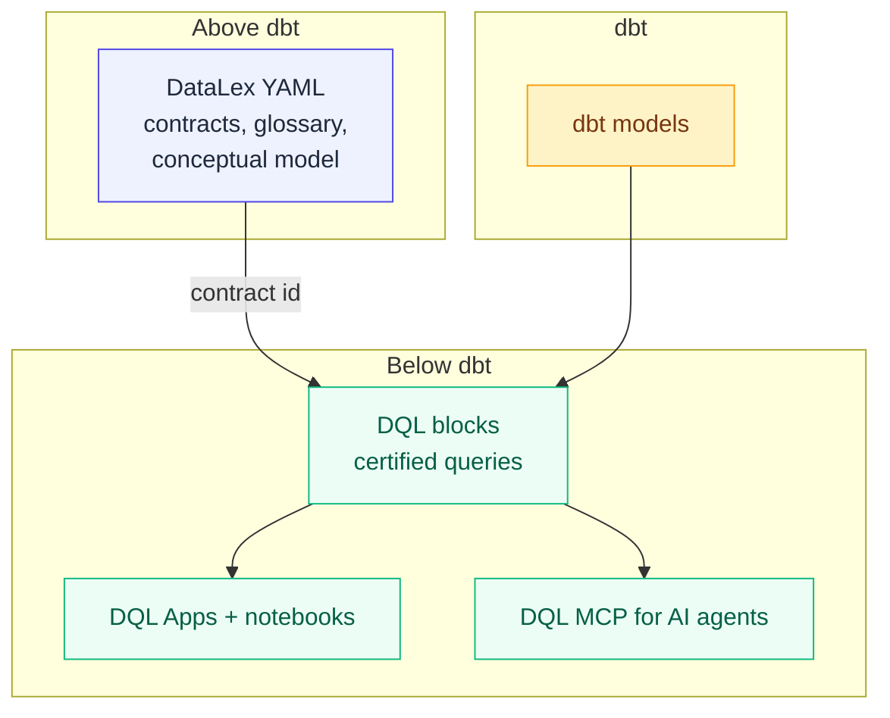

# The DataLex + DQL stack

DataLex and DQL are two open-source languages from DuckCode AI Labs. They're separate repos with separate release cadences, bridged by a public [manifest spec](https://github.com/duckcode-ai/manifest-spec). Together they answer one of the hardest problems in 2026 data: **make sure the same business question returns the same answer no matter who asks — including AI agents.**

This page is the orientation map. For deep dives, follow the links into each language's docs.

---

## The wedge in one sentence

> **One question. One answer. Fully traced — every time.**

Without contracts, the same question — "what was monthly active users last quarter?" — gets different numbers from different teams' AI tools because everyone defines MAU slightly differently. DataLex codifies the definition; DQL serves only certified answers; the lineage is traceable from a chart pixel down to the dbt source column.

---

## How the layers compose



| Layer | Purpose | Source of truth |
|---|---|---|
| **DataLex** (above dbt) | Domains, entities, fields, contracts, governance, glossary | This repo |
| **dbt** (middle) | Transformations, model lineage, semantic-layer metrics | dbt Labs |
| **DQL** (below dbt) | Certified blocks, notebooks, Apps, AI MCP | [duckcode-ai/dql](https://github.com/duckcode-ai/dql) |

---

## What flows between them

A DQL block references a DataLex contract by id:

```dql
block "Monthly Active Customers" {
  type = "custom"
  status = "certified"
  datalex_contract = "commerce.Customer.monthly_active_customers@1"
  query = """
    SELECT DATE_TRUNC('month', ordered_at) AS order_month,
           COUNT(DISTINCT customer_id)     AS monthly_active_customers
    FROM   fct_orders
    GROUP  BY 1
  """
}
```

The DataLex contract that backs it lives in your project's `*.model.yaml`:

```yaml
entities:
  - name: Customer
    contracts:
      - id: commerce.Customer.monthly_active_customers
        name: monthly_active_customers
        version: 1
        signature:
          inputs:
            - name: order_month
              type: date
          outputs:
            - name: monthly_active_customers
              type: integer
              constraints: ["positive"]
```

**At compile time** the DQL compiler resolves the reference against the DataLex manifest. If the contract id doesn't exist, the version pin is missing, or the reference is malformed, compilation **fails** for `status: certified` blocks and **warns** for `status: draft|review` blocks.

**At MCP serve time** the DQL MCP refuses to serve any certified block whose `datalex_contract` reference doesn't resolve — so AI agents (Cursor, Claude Code, Copilot, your internal copilot) only ever get certified, traceable answers.

For the developer-facing explanation of what these contracts mean, where they
come from, and why they should gate certification instead of draft exploration,
see [Contracts for DQL blocks](contracts-for-dql-blocks.md).

---

## End-to-end tutorial

The best way to feel the wedge is to run the joint walkthrough in the separate
example repo:
[`duckcode-ai/jaffle-shop-duckdb`](https://github.com/duckcode-ai/jaffle-shop-duckdb).
It contains the dbt project, `DataLex/`, and `dql/` side by side so the product
repos can stay focused on core language/runtime docs.

1. **Stage 1 — DataLex contracts.** Run `./setup.sh`, scan dbt evidence,
   generate the AI proposal pack, review assumptions, certify accepted
   contracts, and publish `DataLex/datalex-manifest.json`.
2. **Stage 2 — DQL certified blocks.** In `dql/`, validate that certified
   blocks resolve their `datalex_contract` references, then build the Growth
   Command Center from certified blocks only.
3. **Stage 3 — AI agent integration.** Reindex DQL and ask covered and
   uncovered questions. Covered questions cite certified blocks; uncovered
   questions remain review-required.

Start with the example repo's
[Jaffle Shop tutorial](https://github.com/duckcode-ai/jaffle-shop-duckdb/blob/main/docs/tutorials/jaffle/README.md).

---

## The manifest spec

DataLex and DQL never depend on each other's internals. They speak through a published, versioned JSON Schema spec at [`duckcode-ai/manifest-spec`](https://github.com/duckcode-ai/manifest-spec):

- `schemas/v1/datalex-manifest.schema.json` — DataLex compiler output
- `schemas/v1/dql-manifest.schema.json` — DQL compiler output
- `docs/interop.md` — the contract-id binding and resolution rules
- `docs/versioning.md` — SemVer + RFC discipline + 12-month support windows

Third-party tools (Atlan, Marquez, Monte Carlo, Datadog) can read these schemas without depending on either compiler. That's the moat.

---

## Why federation, not a unified product

The two languages have different audiences, different runtimes (Python vs. TypeScript), and different release cadences. Combining them in one repo would slow both down. Federation via spec is the pattern proven by **dbt's manifest, OpenAPI, and OpenLineage**: shared contracts at the boundary, independent evolution at the implementation. We followed that pattern deliberately.
