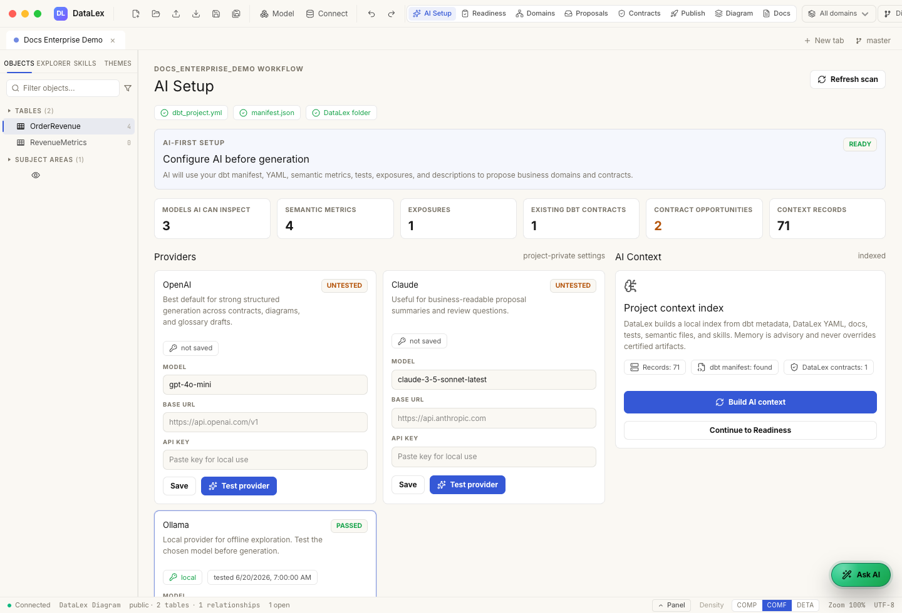

# 3. Configure AI

AI is the primary generation path in DataLex OSS. Readiness works without AI,
but proposal generation requires a saved and tested provider.

## Open AI Setup

In the app, open **AI Setup**.

You should see provider cards for:

- OpenAI
- Claude
- Ollama

The page also shows what dbt evidence DataLex can analyze.



## OpenAI

```bash
export OPENAI_API_KEY="..."
```

In the UI, choose **OpenAI**, pick a model, then click **Save** and **Test**.

## Claude

```bash
export ANTHROPIC_API_KEY="..."
```

In the UI, choose **Claude**, pick a model, then click **Save** and **Test**.

## Ollama

```bash
ollama pull gemma4:12b
ollama serve
```

In the UI, choose **Ollama**:

```text
Base URL: http://localhost:11434
Model: gemma4:12b
```

Click **Save** and **Test**.

## Build context

After the provider test passes, click **Build AI Context**.

DataLex indexes:

- dbt manifest facts
- dbt YAML
- semantic metrics
- tests and relationships
- exposures
- owners and descriptions
- existing contracts
- DataLex artifacts
- project skills under `DataLex/Skills/`

The index is local and advisory. It never overrides certified dbt or DataLex
artifacts.

## Next

Continue to [Generate, review, and certify](04-generate-review-certify.md).
