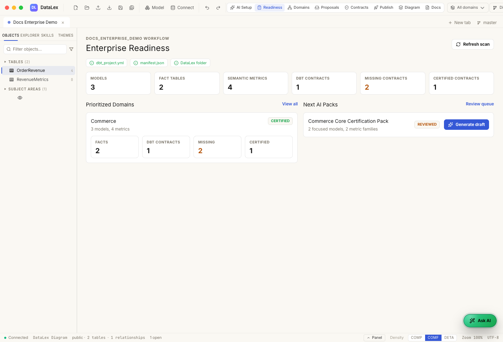
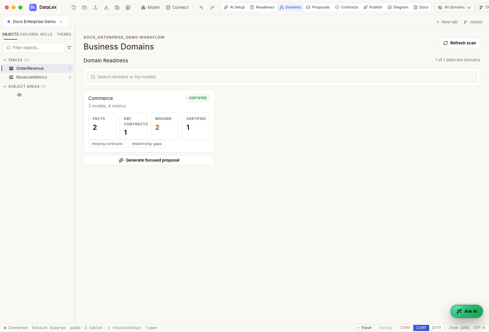
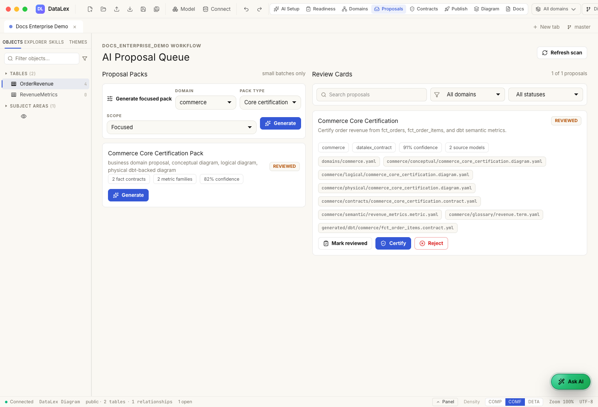
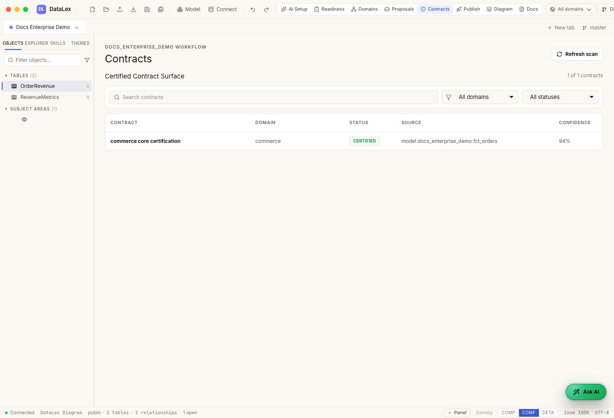

# 4. Generate, Review, and Certify

Generate small proposal packs. Do not generate the whole repo at once.

## Open Readiness

Use **Readiness** to find a focused starting point:

- a semantic metric family
- a high-value fact table
- an exposure
- a group with existing dbt contracts
- a mart used by business teams
- an unassigned group that needs AI domain proposal



## Generate a proposal

Open **Domains** to generate from a domain card, or open **Proposals** to use
the proposal-pack controls. Choose:

- scope: domain, model group, metric family, or selected models
- pack type: contract, metric family, diagrams, glossary, or domain proposal
- size: small batch

DataLex writes `kind: proposal` drafts, not trusted contracts.



## Review evidence

Each proposal should show:

- business meaning
- source dbt models
- columns used
- tests and relationships
- semantic metrics
- inferred grain
- assumptions
- confidence
- open questions
- exact files changed

If the proposal is wrong, reject it or ask AI to fix it. If it is too broad,
split it into smaller packs.



## Certify

Certify only after the proposal is reviewable and business-correct.

Certified proposal packs can create:

```text
DataLex/domains/<domain>.yaml
DataLex/<domain>/conceptual/<pack>.diagram.yaml
DataLex/<domain>/logical/<pack>.diagram.yaml
DataLex/<domain>/physical/<pack>.diagram.yaml
DataLex/<domain>/contracts/<pack>.contract.yaml
DataLex/<domain>/semantic/<metric>.metric.yaml
DataLex/<domain>/glossary/<term>.term.yaml
DataLex/generated/dbt/<domain>/<model>.contract.yml
```

Rejected proposals are excluded from the manifest.



## Next

Continue to [Publish the DataLex manifest](05-publish-manifest.md).
